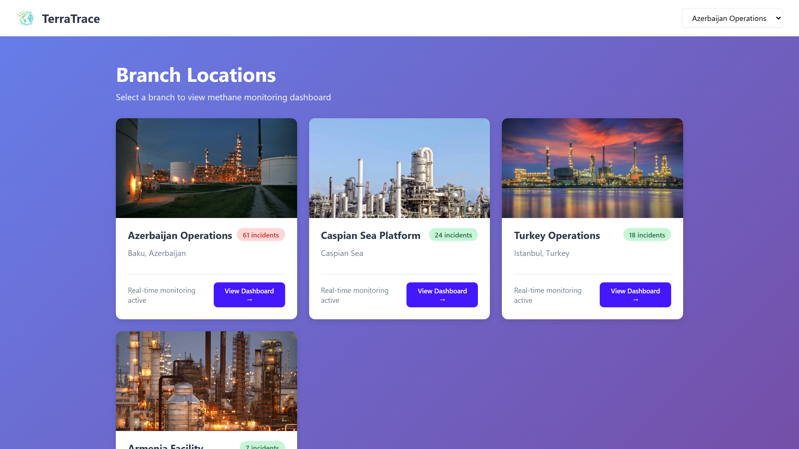
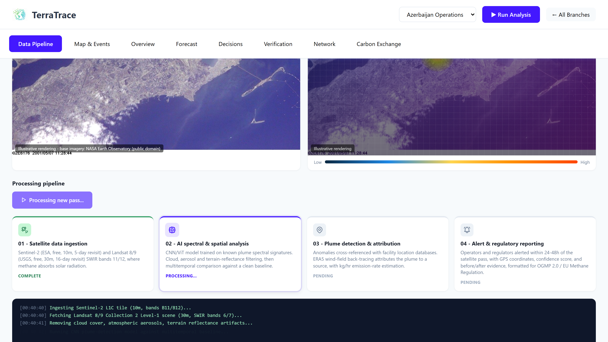
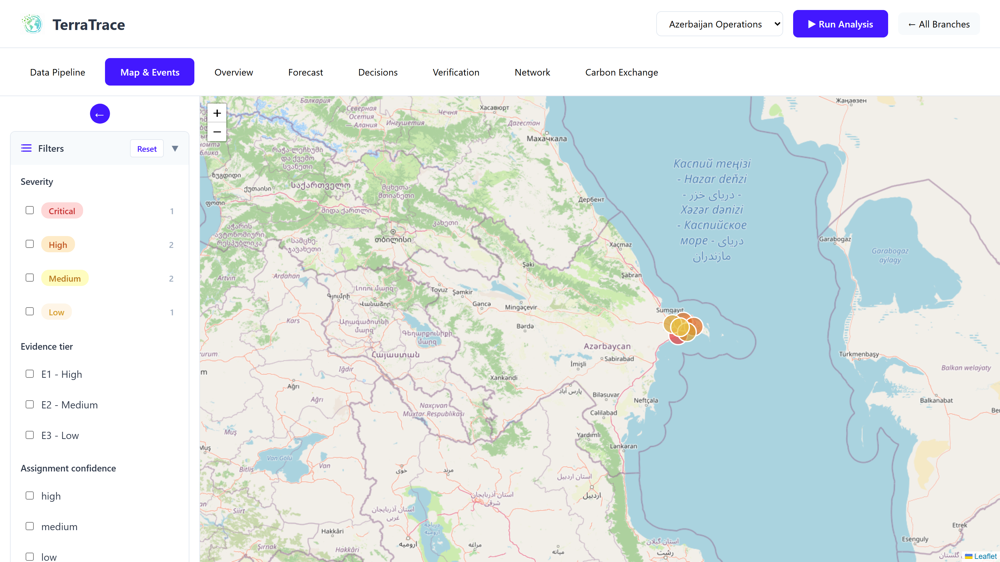
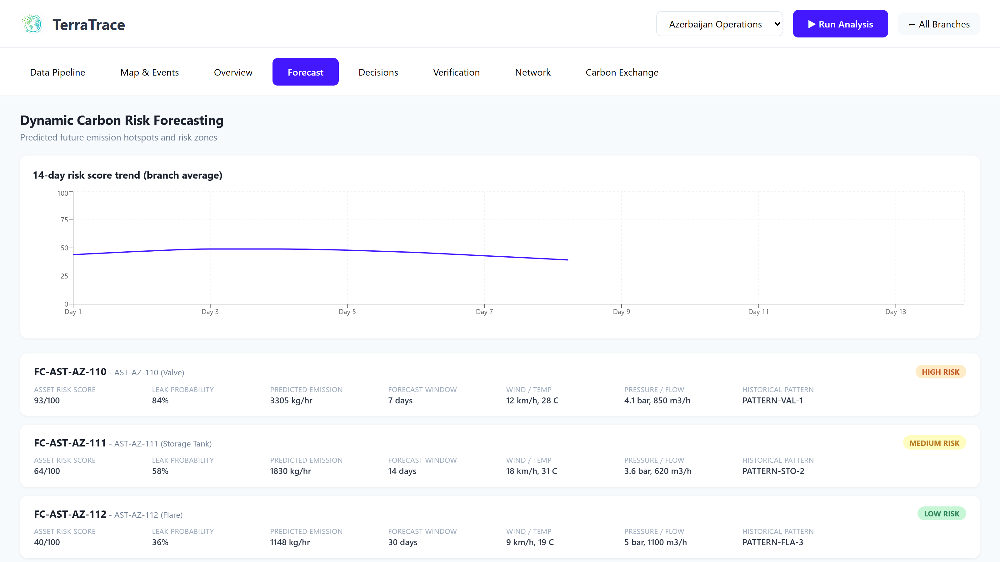
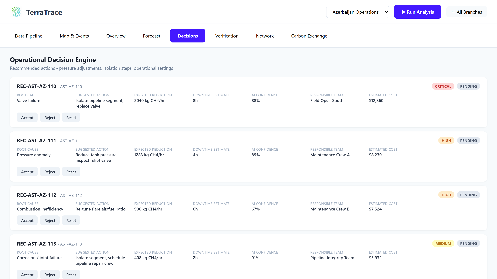
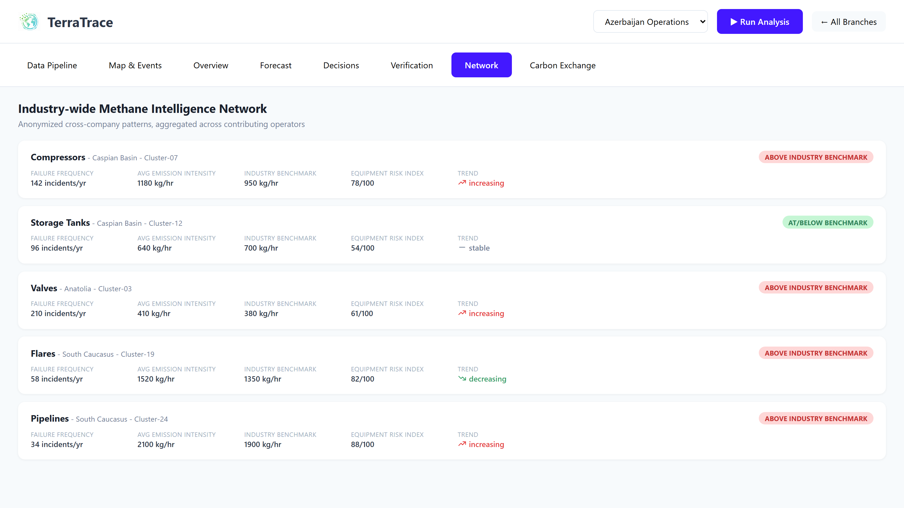
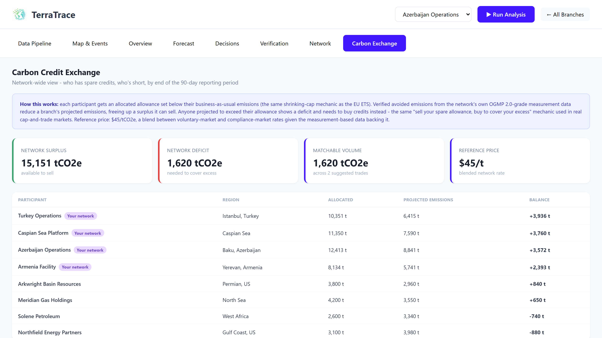

# 🛰️ TerraTrace

### AI + Satellite Methane Intelligence for Oil & Gas Operators

**Turning free satellite imagery into facility-level methane leak detection, operational decisions, risk forecasts, regulatory-grade verification, and a cross-company carbon credit exchange — in a single dashboard.**

Built during the **ICAM Product Development Sprint, July 2026**.

### 🔗 [**Open the live prototype →**](https://dhwanikariya.github.io/terratrace-methane-monitoring/)

No install, no clone, nothing to run — it's a live, click-through dashboard on realistic mock data. Just open the link.



---

## Why this matters

The oil and gas industry leaks an estimated **~124 million tonnes of methane a year** (IEA Global Methane Tracker, 2025–26) — roughly two-thirds the methane footprint of the entire global coal sector. Methane traps **~80x more heat than CO₂** over a 20-year horizon and is responsible for **~30% of global warming** since the Industrial Revolution. Unlike CO₂, it breaks down in the atmosphere in about **12 years, not centuries** — which makes cutting it the single fastest lever humanity has to slow near-term warming.

Here's the part that should make this urgent rather than abstract:

> **The IEA estimates ~30% of oil & gas methane emissions could be eliminated at *zero net cost* — the captured gas is worth enough to pay for the fix.**

The barrier was never economics. It's that **most leaks are never found, or are found too late to act on.**

| Metric | Figure |
|---|---|
| Annual O&G methane leaks | ~124 Mt/yr (oil 45 Mt, gas 36 Mt, coal 43 Mt) |
| Abatable with existing technology | ~70% (~85 Mt), of which ~35 Mt at **zero net cost** |
| Share driven by "super-emitter" events | ~5% of facilities → 50–80% of regional O&G emissions |
| Lost product value from leaked gas | ~$34 billion/yr (UNEP) |
| Countries committed to the Global Methane Pledge | 159 (30% cut by 2030 vs. 2020) |
| Stanford blind study: satellite teams reading the *same* data who got the right answer | only 58% of the time |
| Confirmed leaks (via the UN's MARS alert system) that get any operator response at all | only ~12% |

That last row is the real headline: this isn't only a sensing problem anymore. It's an **AI-reliability problem and an accountability problem** — which is exactly the gap TerraTrace is built to close.

## The detection trilemma

No existing provider combines **global coverage**, **facility-level precision**, and **continuous, low-cost monitoring** at the same time. Every option today forces a trade-off:

| System | Coverage | Resolution / limit | Constraint |
|---|---|---|---|
| TROPOMI / Sentinel-5P | Global, daily, free | ~7×5.5 km — regional only | Cannot attribute to a specific facility |
| GHGSat | Tasked, commercial | ~100–240 kg/hr | Must be scheduled; premium pricing |
| **Sentinel-2 / Landsat** (TerraTrace's source) | Global, free, 5–16 day revisit | 500–5,000 kg/hr depending on surface | Catches super-emitters, not routine leaks — unless paired with AI |
| Aircraft / drone (AIRMO, Carbon Mapper) | Campaign-based | Very high (1–10 kg/hr) | Booked capacity, weeks of lead time, high cost |
| Self-reported inventories | All facilities | Estimated, not measured | Underestimates real emissions by 48–600%+ |
| MethaneSAT (EDF) | Regional | Intermediate | Lost contact, shut down in 2025 — hardware-only bets are risky |

**The insight driving TerraTrace:** Sentinel-2 and Landsat are already in orbit, imaging every oil field on Earth every 5–16 days, for free. Their shortwave-infrared (SWIR) bands are exactly the wavelengths where methane absorbs light — the signal is already in the data. What's missing is an AI layer fast and precise enough to read it at facility level and turn it into an action. **This is a software gap, not a hardware gap.**

## How TerraTrace works — the four-step pipeline

```
Satellite Data (Sentinel-2 / Landsat, free, SWIR bands 11–12)
        ↓
AI Spectral & Spatial Analysis  (CNN / Vision Transformer, cloud & baseline filtering)
        ↓
Plume Detection & Source Attribution  (wind-field back-tracing → facility, kg/hr estimate)
        ↓
Alert, Dashboard & Regulatory Reporting  (<48h, OGMP 2.0 / EU Methane Reg. formatted)
```

1. **Satellite data ingestion** — Sentinel-2 (ESA, free, 10m, 5-day revisit) and Landsat 8/9 (USGS, free, 30m, 16-day revisit), using SWIR bands 11/12 where methane leaves a spectral fingerprint.
2. **AI spectral & spatial analysis** — a CNN/Vision Transformer trained on known plume signatures detects anomalies, filters cloud/aerosol/terrain noise, and compares each pass against a clean baseline to cut false positives.
3. **Plume detection & source attribution** — anomalies are cross-referenced against facility location databases, then ERA5 wind-field back-tracing attributes the plume to a source and estimates emission rate in kg/hr — the exact metric OGMP 2.0 and the EU Methane Regulation require. Events over threshold are auto-flagged as **super-emitters**.
4. **Alert, dashboard & regulatory reporting** — operators and regulators get alerted within 24–48 hours of a satellite pass with GPS coordinates, emission rate, confidence score, and before/after imagery — pre-formatted for compliance disclosure.

## What's in this repo

The working prototype is a single React dashboard implementing all seven modules from the product's Solution Document, plus a Carbon Credit Exchange — eight tabs, one operational picture per facility.

| Tab | What it shows |
|---|---|
| **Branch Locations** (home) | All monitored sites with live incident counts — select one to enter its dashboard |
| **Data Pipeline** | How a new detection actually reaches the dashboard: satellite pass cadence (incl. cloud-cover skips), a real base-layer satellite image next to the AI-processed methane probability heatmap, and an animated 4-step pipeline with a live terminal-style log |
| **Map & Events** | Facility-level incident map with severity / evidence-tier / confidence filters and a dedicated super-emitter panel (plume size, wind direction, dispersion prediction, response status) |
| **Overview** *(Executive Command Center)* | Total CH₄ emissions, active events, super-emitter status, avoided emissions, AI-generated operational risk score, asset health, estimated financial impact |
| **Forecast** *(Dynamic Carbon Risk Forecasting)* | Per-asset risk scores and leak probability, a 14-day network risk trend, forecasts incorporating wind, temperature, pressure and flow-rate |
| **Decisions** *(Operational Decision Engine)* | Root-cause-linked recommendations (valve failure, seal degradation, pressure anomaly) with expected reduction, downtime, cost, and Accept / Reject / Reset actions |
| **Verification** *(Avoided Emissions Verification Engine)* | Before/after emissions per intervention, CO₂e reduction, evidence source, confidence, full audit trail, carbon-credit eligibility, ESG category (CSRD/GRI/TCFD) |
| **Network** *(Industry-wide Methane Intelligence Network)* | Anonymized cross-company equipment benchmarks — failure frequency, emission intensity vs. industry average, equipment risk index, trend direction |
| **Carbon Exchange** | Cap-and-trade style allowances (85% of business-as-usual emissions), verified reductions freeing up sellable surplus, and an auto-matching engine pairing largest surplus with largest deficit — modeled on real EU ETS / voluntary registry mechanics (Suggested → Proposed → Accepted → Retired) |

### Screenshots

<table>
<tr>
<td></td>
<td></td>
</tr>
<tr>
<td></td>
<td></td>
</tr>
<tr>
<td></td>
<td></td>
</tr>
</table>

## Why not just use an existing provider?

| Player | Approach | Where it leaves a gap |
|---|---|---|
| **AIRMO** | Public satellite feeds + booked aircraft/drone campaigns; building a proprietary satellite constellation for 2027 | Zero satellites in orbit today; capacity-constrained, enterprise-priced |
| **Kayrros** | TROPOMI + opportunistic tasking, feeds the IEA/UNEP's own trackers | Methane is one line inside a broader market-data business, not a dedicated product |
| **Arolytics** | Sensor-agnostic workflow/LDAR layer ingesting 125+ sources | Not a detection company — a downstream integration partner |
| **GHGSat** | Purpose-built nanosatellite constellation, ~100–240 kg/hr | Must be tasked to a site; premium commercial pricing |
| **Carbon Mapper** | Hyperspectral aircraft + EMIT satellite | Strong science, limited commercial scale |
| **Orbio Earth** | Free Sentinel-2 SWIR + AI — closest technical proof point (correctly classified every valid release in a 2024 Stanford blind study) | Validates the approach TerraTrace is built on |
| **MethaneSAT (EDF)** | Purpose-built satellite | Lost contact, shut down in 2025 after 15 months |

**TerraTrace's angle:** run entirely on already-orbiting free imagery (no hardware or launch risk), stay self-serve and unrationed (no booked capacity or minimum contracts), and serve the tier the premium players structurally leave behind — **small-to-mid operators and emerging-market regulators** who need continuous, low-cost screening rather than an enterprise-only tasked satellite contract.

## Tech stack

- **React 18 + Vite** — frontend framework and build tooling
- **React Router** — client-side routing (`/` branch list → `/dashboard/:branchId`)
- **Leaflet / react-leaflet** — interactive facility & incident mapping
- **Zustand** — cross-tab state (decision statuses, trade lifecycle)
- **Recharts** — risk trend & forecast charting
- **Tabler Icons, date-fns** — UI icons and date handling

## Running it locally

The [live demo link](https://dhwanikariya.github.io/terratrace-methane-monitoring/) above is all you need to see the prototype — the steps below are only for working on the source.

```bash
npm install
npm run dev
```

Visit **http://localhost:5173**.

```bash
npm run build     # production build
npm run preview   # preview the production build
npm run lint       # eslint
```

## Honest status check

The current build is a **fully working, click-through dashboard running on realistic mock data**, generated from the same field model the real pipeline would use (facility IDs, equipment types, kg/hr rates, wind/weather conditions, confidence scores). There is **no live satellite ingestion, trained detection model, or real registry integration yet** — that's intentional and tracked on the roadmap below, not glossed over. A demo audience (or a reader of this repo) should know exactly what's real today versus what's architected for.

## Roadmap

- **Phase 1 (current)** — validated product narrative; full-featured mock-data prototype across all 7 Solution Document modules + Carbon Exchange
- **Phase 2** — real Sentinel-2 / Landsat ingestion pipeline; train and validate a super-emitter detection model against known controlled-release datasets, matching the Stanford blind-study methodology
- **Phase 3** — pilot with 1–2 small-to-mid operators or a national regulator; real OGMP 2.0-formatted reporting output
- **Phase 4** — registry integration (Verra / Gold Standard–style retirement ledger) so the Carbon Exchange handles real, auditable credits instead of modeled ones

## Regulatory tailwind

- **EU Methane Regulation (2024)** — non-compliant gas imports face market access restrictions by 2030
- **US EPA OOOOb/c (2024)** — mandates leak detection & repair, including satellite-triggered super-emitter response
- **OGMP 2.0** — 140+ operators committed to measurement-based (not estimated) reporting
- **Global Methane Pledge** — 159 countries, targeting a 30% cut by 2030 vs. 2020 levels

The MRV (measurement, reporting, verification) technology market for methane is projected to reach **$2–5B+ by 2030** as these mandates take effect.

## Project docs

The full research and product narrative behind this prototype lives in [`/docs`](docs):

- [`TerraTrace_Final_Product_Report.docx`](docs/TerraTrace_Final_Product_Report.docx) — the complete write-up: problem, competitive landscape, solution, product walkthrough, business model, architecture, roadmap
- [`TerraTrace_Detection_Gap_Research_Brief.docx`](docs/TerraTrace_Detection_Gap_Research_Brief.docx) — deep dive on why the detection trilemma is the real bottleneck
- [`TerraTrace_Demo_Script.docx`](docs/TerraTrace_Demo_Script.docx) — the live demo walkthrough script
- [`PlumeAI_Project_Document.docx`](docs/PlumeAI_Project_Document.docx) — the original data-model / feature specification (project's working name before TerraTrace)
- [`TerraTrace_Pitch_Deck.pptx`](docs/TerraTrace_Pitch_Deck.pptx) — the pitch deck

---

*Built for the ICAM Product Development Sprint, July 2026. Methane is invisible, but the signal to find it is already in the sky, in data we can access for free — TerraTrace exists to close the gap between having that data and acting on it.*
